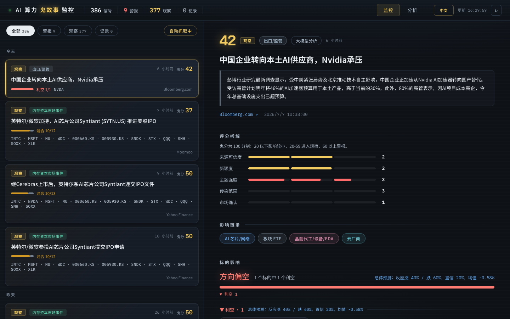
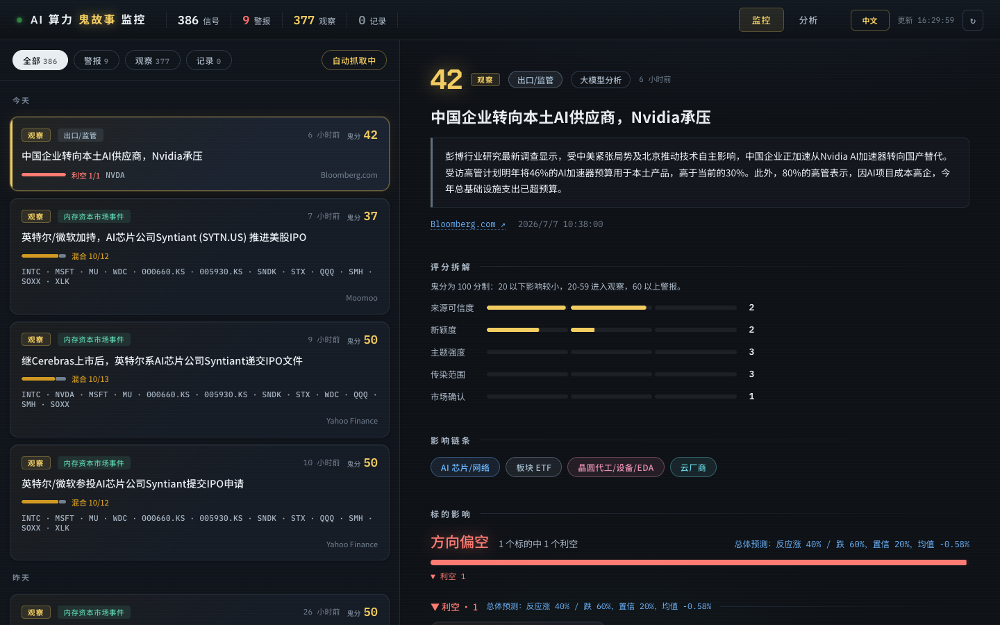
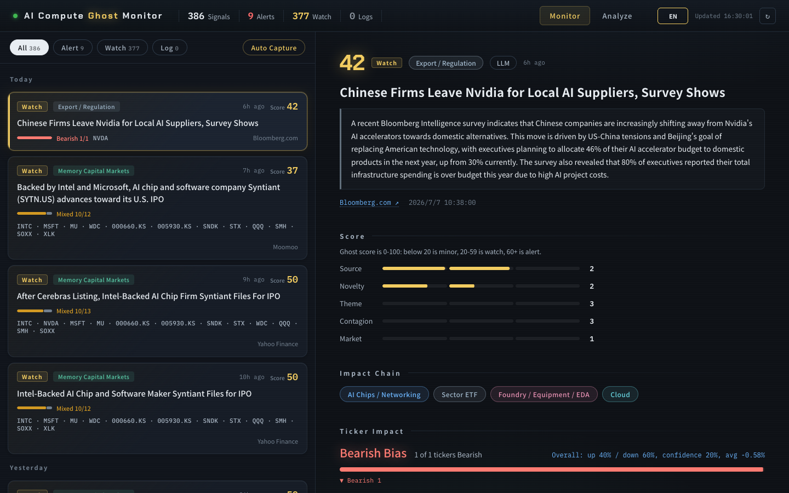

# AI Compute Ghost Monitor

AI Compute Ghost Monitor is a local research dashboard for tracking market-moving AI infrastructure narratives: compute oversupply, GPU/HBM demand, cloud CapEx, export controls, data-center delays, financing pressure, and semiconductor supply-chain shocks.

It turns news into bilingual signal cards with affected tickers, direction labels, model-assisted reasoning, and reaction-trading-day price impact.

> Research tool only. Not investment advice, not a trading system, and not a guarantee of future returns.



## Why This Exists

AI infrastructure trades increasingly move on narratives before clean data arrives: "too much compute", "HBM shortage", "cloud CapEx is too high", "export controls", "data center delays", or "memory capacity flood".

This project helps you answer three practical questions:

- What happened?
- Which tickers and supply-chain layers are exposed?
- What happened on the reaction trading day?

## Screenshots

### Ticker Impact

See the affected chain by direction, with reaction close and reaction-day move when price data is available.



### English Mode

Switch to an English-only interface for sharing or reviewing with global teams.



### Single News Analysis

Paste one headline or summary and run the same scoring pipeline locally.


## Features

- Live news capture from QVeris / Alpha Vantage news tools.
- DeepSeek-powered translation and narrative analysis.
- Chinese / English UI switch.
- 100-point ghost score:
  - `<20`: minor signal
  - `20-59`: watch
  - `60+`: alert
- Direction mapping across AI chips, memory, cloud, power/cooling, server infra, foundry/equipment/EDA, and ETFs.
- Reaction-trading-day price impact using Yahoo Finance chart data.
- Local duplicate cache to avoid repeatedly analyzing the same news.
- Tiered auto-capture schedule to reduce API cost:
  - every 5 minutes: global technology news
  - every 15 minutes: core AI tickers
  - every 60 minutes: full tracked universe
  - daily after market close: full backfill pass

## Requirements

- Python 3.10+
- A QVeris API key
- A DeepSeek API key

No Python package install is required for the current prototype; it uses the Python standard library.

## Get API Keys

### QVeris

Register at [qveris.ai](https://qveris.ai).

The project uses QVeris tool execution for Alpha Vantage news capture.

### DeepSeek

Create an API key at [platform.deepseek.com](https://platform.deepseek.com).

DeepSeek is OpenAI-compatible, so the project uses:

```bash
OPENAI_BASE_URL=https://api.deepseek.com
OPENAI_MODEL=deepseek-chat
OPENAI_API_KEY=...
```

### Optional: Firecrawl

Firecrawl can enrich historical article text when building datasets.

Register at [firecrawl.dev](https://www.firecrawl.dev).

## Quick Start

Clone the repo:

```bash
git clone https://github.com/AlexLiu0130/ai-compute-ghost-monitor.git
cd ai-compute-ghost-monitor
```

Create your local env file:

```bash
cp .env.example .env
```

Fill in:

```bash
QVERIS_API_KEY=...
OPENAI_BASE_URL=https://api.deepseek.com
OPENAI_MODEL=deepseek-chat
OPENAI_API_KEY=...
```

Run:

```bash
python3 -m ghost_monitor.server
```

Open:

```text
http://127.0.0.1:8765
```

## Manual Capture

From the UI, click `自动抓取中` / `Auto Capture`.

Or call the endpoint:

```bash
curl -X POST -H 'x-ghost-action: 1' http://127.0.0.1:8765/api/capture
curl http://127.0.0.1:8765/api/capture/status
```

## Historical Backfill

Fetch and score historical news:

```bash
python3 -m ghost_monitor.backfill_history 2026-04-06 2026-07-06
```

Build a two-year dataset with optional Firecrawl enrichment:

```bash
python3 -m ghost_monitor.dataset_builder 2024-07-06 2026-07-06 200
```

Train/update the lightweight direction model:

```bash
python3 -m ghost_monitor.train_ml
```

## Test

```bash
python3 -m unittest discover -s tests -p 'test_*.py'
node --check web/main.js
```

## Open Source Safety

The repository intentionally ignores local runtime data:

- `.env` and all local key files
- `data/` generated captures, caches, model files, and price windows
- `reports/` generated backfill reports
- local scratch handoff notes

Keep only source code, tests, samples, docs, and public screenshots in Git.

## Project Layout

```text
ghost_monitor/     backend capture, scoring, LLM, ML, price impact
web/               local dashboard
samples/           small public sample news items
tests/             unit tests
docs/screenshots/  public README screenshots
```

## License

MIT
